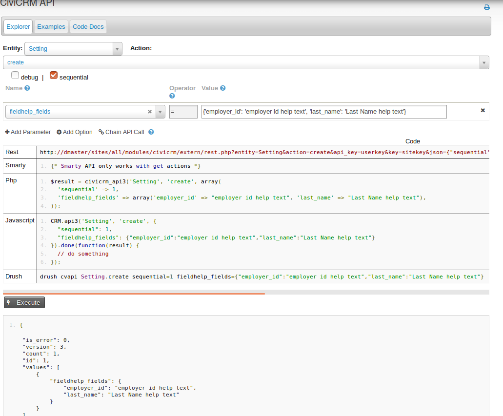

This Extension:
==============

Creates three settings: fieldhelp_activities, fieldhelp_organizations, fieldhelp_individuals.

Each take a json object to be entered thru the API explorer see example below :



For individual contacts the fieldhelp_individuals setting:

```js
// fieldname: 'help text',
{
  first_name: 'Enter the legal name of the individual.',
  employer_id: 'Select the current employer in CiviCRM.',
  job_title: 'Enter the individual’s full title.',
  preferred_language: 'What is the person’s preferred language?'
}

```

Weird Fields that are handled differently:
-----------------------------------------

###### fieldhelp_activities
N/A

###### fieldhelp_organizations and fieldhelp_individuals
Email_Block_1  
preferred_communication_method_1

Future Features
---------------
- Adding a settings page so one can update help text thru the ui
